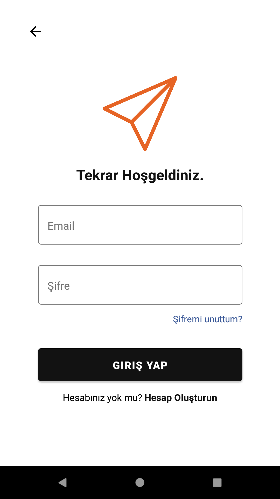
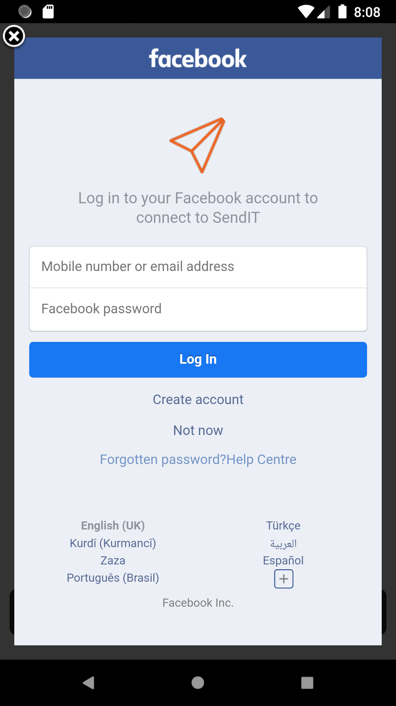
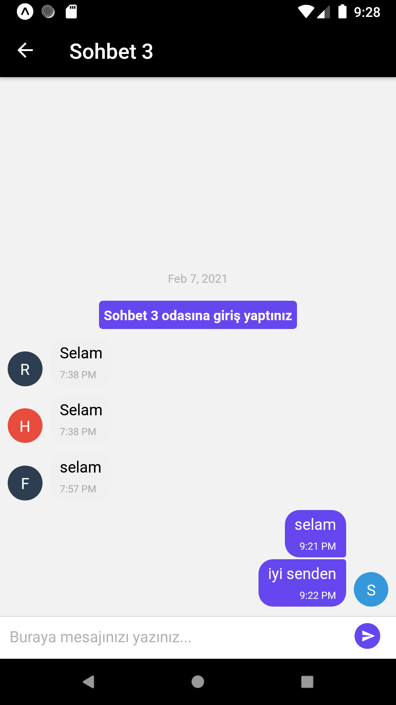

# React-Native_Chat-App
React native and firebase/firestore

# Screenshots

<p  align="center">
  
  
  
  
</p>

# Setup

```ruby
yarn install
yarn android
```
# Firebase Setup

go to  --> ./src/core/config.js

and add your firebase web config 

open firebase Auth. email/password and facebook 
